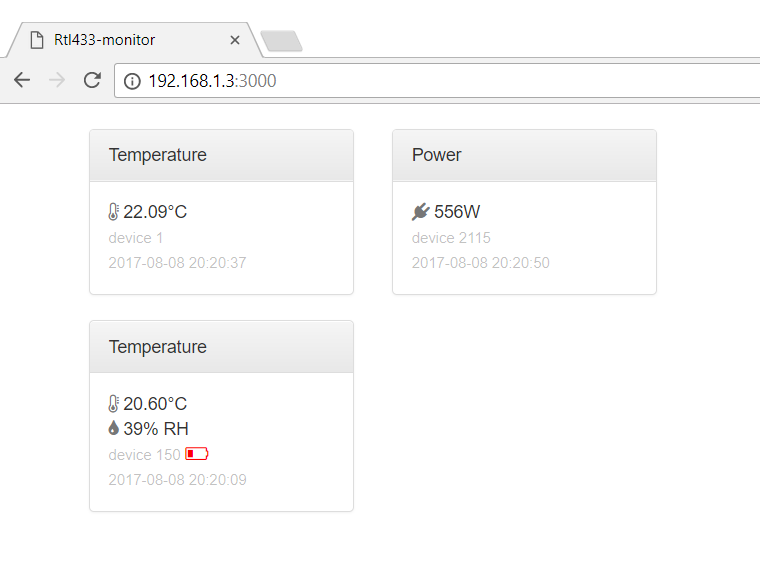

# rtl433-webmon
Web front end for a software defined radio reading sensors.  
Serves a simple webpage using websockets and Angular to display live
data received from 433MHz sensors.

Uses [rtl_433](https://github.com/merbanan/rtl_433) to receive and decode sensors transmissions

### Inputs:
- 433MHz temperature/humidity sensors that can be received and decoded by rtl_433
- PMS5003 air quality particulates sensor via serial port
- temperature/humidity device polled from Samsung SmartThings cloud

### Logging:
- Readings logged every 5mins to AWS CloudWatch

### Web Display:
Immediate readings for 
- Temperature and humidity (%RH)
- Electrical Power (Watts)
- Air Quality (PM2.5 and PM10 counts)

### Setup
- Make your a copy of each `secret_config/*.json.template` file as `secret_config/*.json` and fill in the necesary values.
- Build or install [rtl_433](https://github.com/merbanan/rtl_433), and ensure that `rtl_433` can successfully find and read your software defined radio device (eg. an RTL2832-based USB TV dongle).
- Edit `devices: [...]` in `index.js` to include the 433MHz device models you wish to receive (rtl_433 -R parameters)

### Running
Run in the foreground: `npm start`

Or run as a daemon (uses [`forever`](https://github.com/foreverjs/forever)):  
`npm run start-daemon`  
`npm run stop-daemon`  

Debug logging is output by setting variable `DEBUG` with named loggers eg: `DEBUG=webmon npm start`
